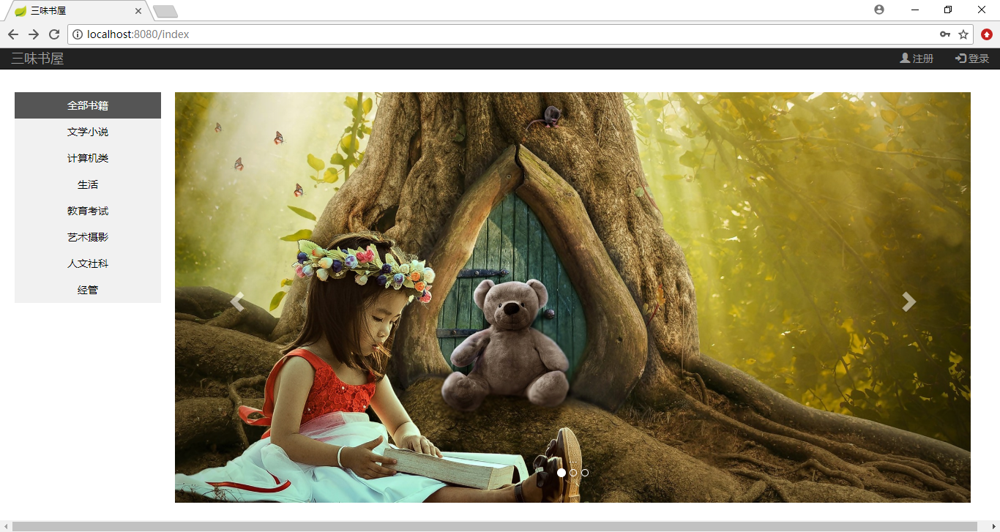
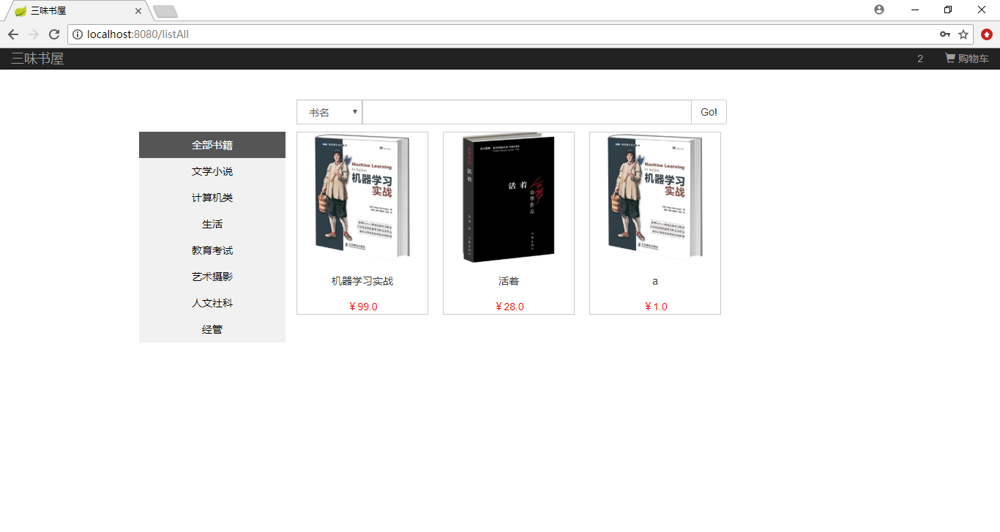
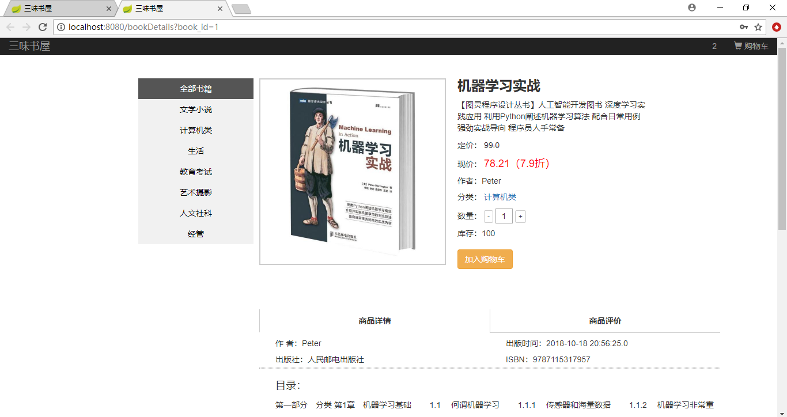
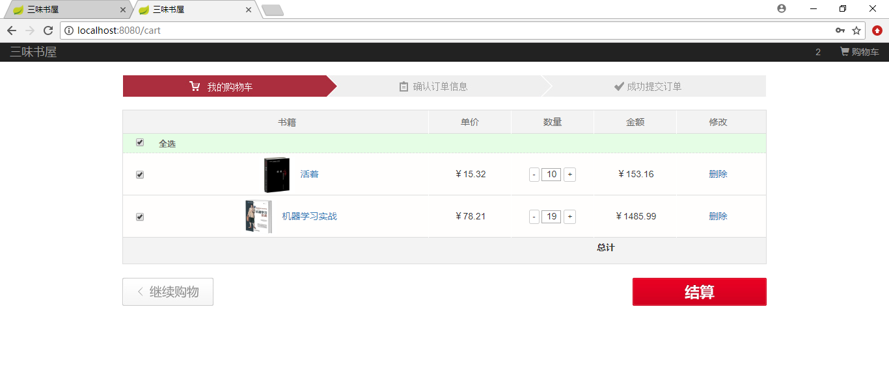
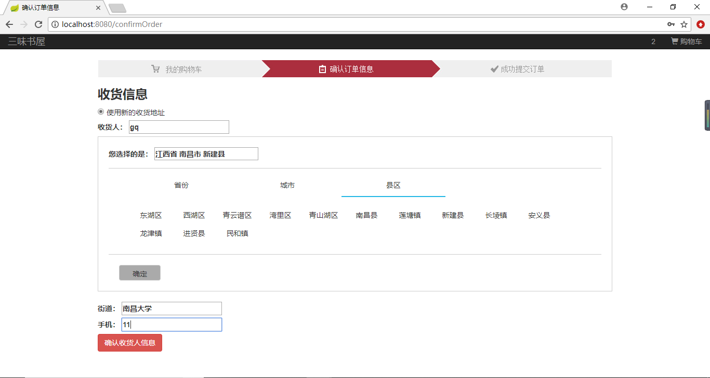
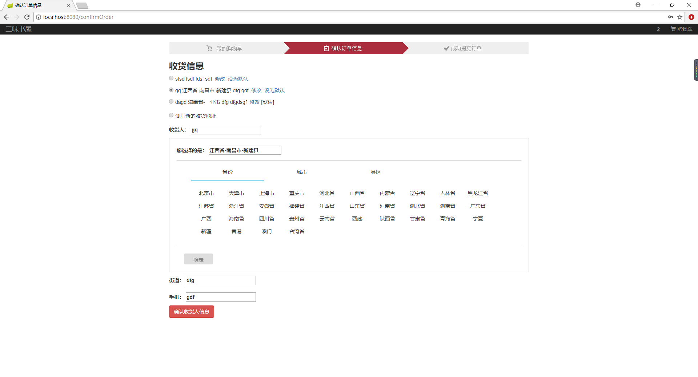
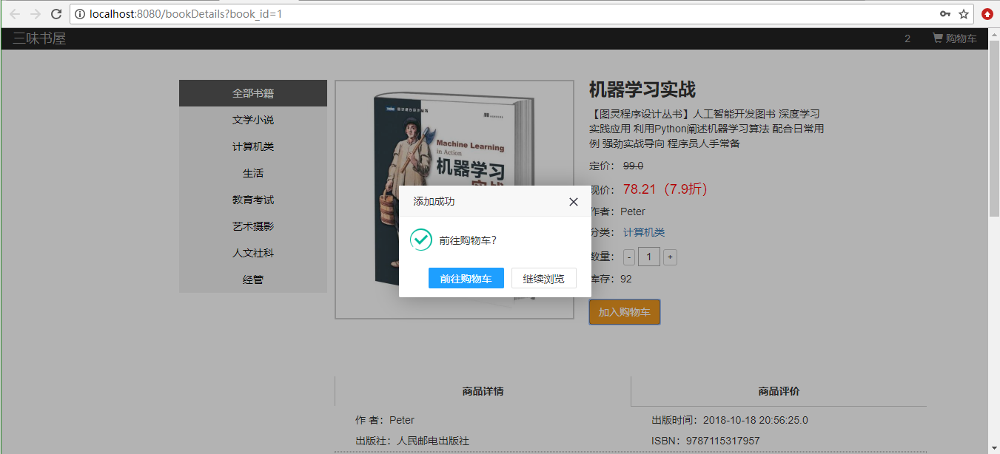
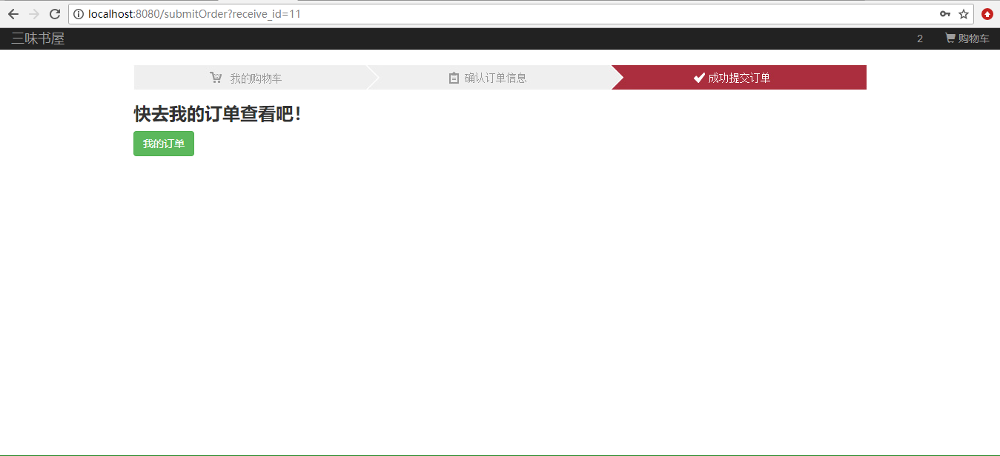
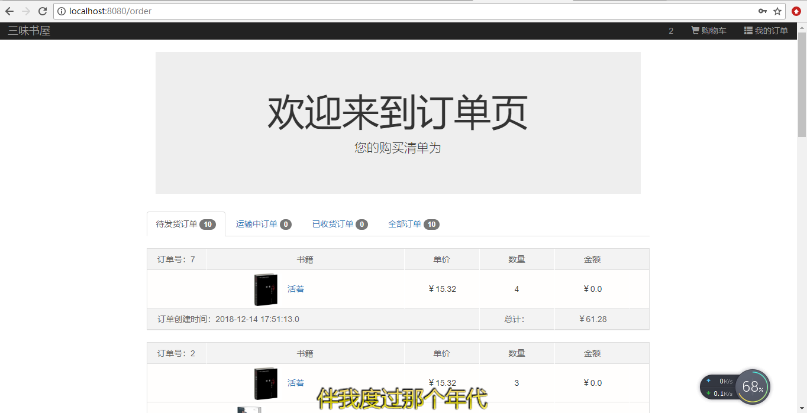

## 基于Springboot+SpringSecurity+Thymeleaf+Mysql的网上书城

### 主要用到的技术
- 使用 **Springboot**+**Mysql** 搭建整个系统
- 使用 **Springsecurity** 管理用户登录权限
- 使用 **Thymeleaf** 模板实现页面静态化
- 使用 **Bootstrap+Jquery** 框架开发前端界面
- 使用 **Hibernate** 自动生成数据库
### 功能模块
- **用户模块**
	- [x] 用户注册、登录
	- [x] 个人信息修改
	- [x] 密码修改
	- [x] 注销登录
- **商品模块**
	- [x] 首页轮播图
	- [x] 全部书籍展示
	- [x] 分类展示
	- [x] 书籍详细信息
- **购物车模块**
	- [x] 加入购物车
	- [x] 查看购物车
	- [ ] 结算购物车
### 部分功能展示

> 引入超好看的layer.js组件

### 成功提交订单

### 完成展示待发货商品功能
